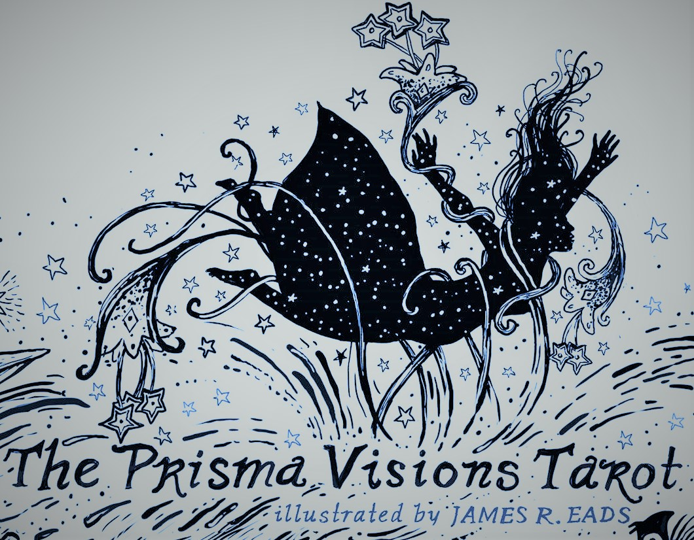
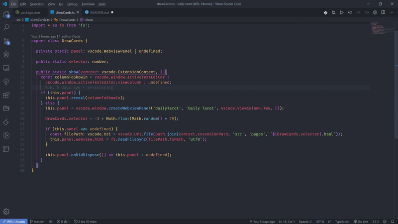

# Daily Tarot

> _Prisma Visions Tarot - Unofficial Extension_  
> **Get this amazing tarot deck [Here](https://www.jamesreadsmerch.com/products/prismavisions)**

## Journey of the Tarot

- Traditionally tarot has been used for divination - as a method to 'look into the future'.
- However, a more interesting way to understand tarot - is a tool to unravel the unspoken voice of the self.
- Cards are something tangible on which we can project our feelings and thoughts.

## Quick Start

## Features

- Two mode: 
  - `Draw a Card` - card of the day
  - `Ask a Question` - input box will convey your will
- Status bar:
  - Show your daily card
  - Click on it to ask a question  

## Requirements

- Visual Studio Code: 1.41.0+
- Internet connection

## About Prisma Vsion

- This deck is illustrated, designed and edited by James R. Eads. The extensive guide is written by Katherine Tombs.
- I own the 5th edition of this deck and love it a lot. It gives me many suggestions to learn more about my subconscious and feelings, thus helping me become better.
- If you like this tarot deck just as I do, please support the author [here](https://www.jamesreadsmerch.com/products/prismavisions).
- Expore the imagery and meanings. Feel the energy and listen to the universe.

## Release Notes

### 0.1.0

Initial release.

**Enjoy!**

